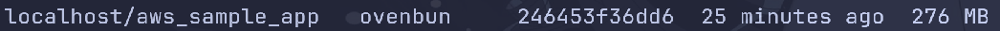
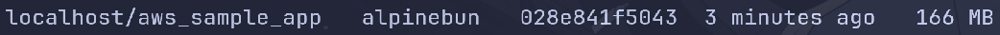

Context:

- I am trying to learn AWS stuff.
- To do that, I'm currently building a sample app using Bun and Hono.
- After running `bun create hono@latest`, I bootstrapped three Containerfiles:

# Containerfile 1: Official `oven/bun` base image.

This is the simplest of the three container files.

- Use oven/bun as base image;

- Copy package.json and bun.lock
- Bun install
- Copy rest of the app
- Run

This results in an image size of 276 MB

Upsides:

- Brief and Simple

Downsides:

- When using nix, a mismatch might happen between bun versions inside the container and inside the devShell
- Very large at 276 MB
- Base image in itself is 121 MB

# Containerfile 2: `alpine` then install `bun`.

This, on the other hand is a bit more complex.

- Use alpine as base image;
- Install `bash`, `curl`, `libstdc++`, `libgcc`
- Install `bun` through recommended installation via `curl`
- Add `bun` binary to `$PATH`

- Copy package.json and bun.lock
- Bun install
- Copy the rest of the app
- Run

This results in an image size of 166 MB

Upsides:

- Lowest image size
- Still relatively simple

Downsides:

- Like `oven/bun`, no single source of truth
- Adding more runtime binary dependencies require investigating which shared libraries are needed as alpine ships with `musl` not the standard, widely-used `glibc`

# Containerfile 3: Two-step image building via `nix` + `busybox`

This is the most complex of the three. This is loosely based off of Mitchel Hashimoto's [ tutorial ](https://mitchellh.com/writing/nix-with-dockerfiles)

Builder step:

- Use `nixos/nix`
- Configure `/etc/nix/nix.conf` to enable the following flags
  - `experimental-features = nix-command flakes`
  - `auto-optimise-store = true`
  - `connect-timeout = 30000`
    > I included this as I keep on encountering connection timeouts.
- Copy nix related files: `flake.nix flake.lock ./nix/dependencies.nix`
- Run `nix build` to build the link farm `dependencies` onto `/tmp/build/result`
- Create `/tmp/nix-store-closure` and copy the store closure of the link farm

Actual image:

- Use `busybox:glibc`
- Copy the closure (`/tmp/nix-store-closure`) the dependency binaries (`/tmp/build/result`) from `builder`
- Symlink the actual dependency binaries (`/tmp/build/result/*/bin/*`)onto `/nix-bin` and add that to `$PATH`

- Copy package.json and bun.lock
- Bun install
- Copy the rest of the app
- Run

This results in an image size of 191 MB

Upside:

- Single source of truth. `bun` version is from `flake.nix`
- Slightly more reproducible as dependency sources are locked in `flake.lock`
- Builder step is cached and only invalidated when other binary dependencies are introduced in nix

Downsides:

- Multi-step, more complex
- Builder step requires extensive Nix knowledge
- Bun is sourced from the binary cache, or built from scratch
  > Could be an upside, depends on you
- Actual image requires copying the closure and dependency binaries from the builder
