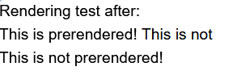

# Clarifying common NextJS terms

## Server Components and Client Components

In NextJS, Server Components and Client Components seemingly differentiates component rendering boundaries. Naively, one would often confuse the two as such:

> "Server Components" are the React components rendered in the server
>
> "Client Components" are the React components rendered in the client

However, this gives us the wrong idea. While it is entirely true that Server Components are always rendered within the server, Client components, on the other hand, does not imply the same jurisdictional constraints.

Actually, calling them client components is very misleading. These components are rendered once in the server when SSR is enabled[^1]. To be more specific, Client components are rendered once in the server to produce an initial HTML shell/placeholder. Afterwards, this HTML shell/placeholder gets hydrated once it reaches the client.

[^1]: https://github.com/reactwg/server-components/discussions/4

We can verify this as such:

```tsx
"use client";
// page.tsx
import ClientComponent from "./ClientComponent";
import dynamic from "next/dynamic";

const ClientComponentNoSSR = dynamic(() => import("./ClientComponentNoSSR"), {
  ssr: false,
});

export default function Page() {
  return (
    <>
      <span> Rendering test after: </span>
      <ClientComponent />
      <ClientComponentNoSSR />
    </>
  );
}
}

// ClientComponent.tsx
"use client";
import { useState } from "react";

export default function ClientComponent() {
  const [state, _] = useState("This is not")
  return <div> This is prerendered! {state}</div>
}

// ClientComponentNoSSR.tsx
"use client";

export default function ClientComponentNoSSR() {
  return <div> This is not prerendered! </div>;
}

```

Getting the resulting HTML from `page.tsx` gives us a `body` element with the following contents:

```
<body>
  ...
  <span> Rendering test after: </span>
  <div> This is prerendered! </div>
  <template ...></template>

</body>
```

This shows us that by default, `ClientComponent` is rendered once within the server. Since the function is called only once, hooks like `useState` are not processed and hence the initial server render produces only `<div> This is prerendered! </div>`.

With regards to `ClientComponentNoSSR`, the functions is never called within the server thus no HTML rendering gets injected. Instead, NextJS attaches a `<template/>` so that it knows where to render and hydrate the component client-side.

Looking at the actual page output, we see the following



```
<body>
  <div>
    This is prerendered!
    This is not
  </div>
  <div> This is not prerendered! </div>
</body>
```

After hydration and client-side rendering, we obtain the rest of the components.

This shows that the term Client Component is indeed a misnomer. The name "Classic Components" might suite it better.
